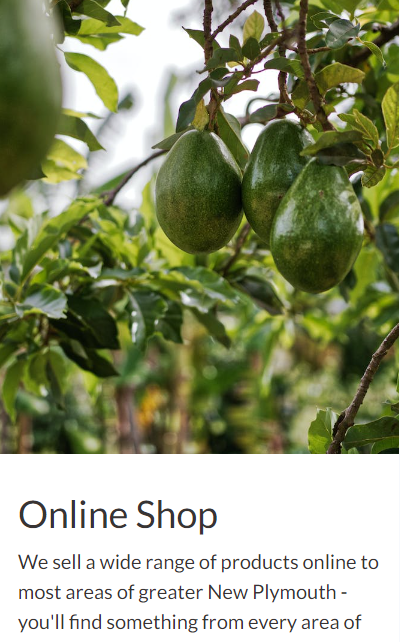
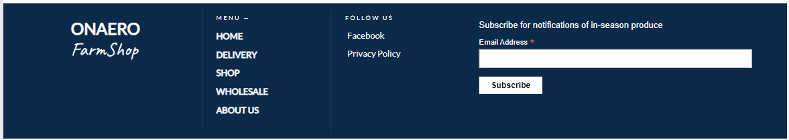
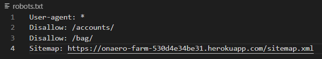

# Onaero FarmShop - Organic Fruit and Vegetables #

* Onaero (Oh-nigh-row) Farmshop is a locally owned organic farm based in Taranaki, New Zealand. We have 300 avocado trees and an extensive variety of seasonal fruit trees, vegetables, nuts, eggs and honey. 
Site registration is possible, which allows users to save their delivery information and view a history of their orders.

The live version of the website is available for you here : <a href="https://onaero-farm-530d4e34be31.herokuapp.com/" target="_blank">OnaeroFarm</a>
And the github repository is available here : <a href="https://github.com/garymast/onaero-farm">Onaero Farm</a>

# README CONTENTS # 
* ## [UX](#ux-1)
   * [User Stories](#user-stories)
   * [Agile Methodologies](#agile-methodologies)
   * [The Scope](#1-scope)
   * [Structure](#2-structure)
   * [Skeleton](#3-skeleton)
   * [Surface](#4-surface)

* ## [E-Commerce Model](#e-commerce-model-1)
    * [Business Owners Goals](#business-owner)
    * [Project Goal](#project-goals)
    * [Social Media](#social-media)
    * [Marketing](#marketing)
    * [Newsletter](#newsletter)

* ## [Search Engine Optimization](#search-engine-optimization---seo-1)
    * [Meta](#meta-descriptions)
    * [Sitemap](#sitemap-file)
    * [Robots](#robots-file)

* ## [Testing](#testing-1)
    * [Testing Documentation](#testing-documentation)
    * [Defensive Programming](#defensive-programming)

* ## [Deployment](#deployment-1)
    * [Setting Up](#setting-up)
    * [Initial Installations](#initial-workspace-installations)
    * [Database Setup](#database-setup)
    * [AWS Setup](#amazon-web-services--aws)
        * [S3](#s3-buckets)
        * [Adjust Bucket Policy](#adjust-bucket-policy)
        * [Create IAM User/UserGroup](#create-user-and-user-group-in-iam)
        * [Create Media Folder](#create-media-folder)
        * [AWS to Django](#aws-to-django)
    * [Project Settings Adjustments](#project-settings-adjustments)
    * [Heroku Deployment](#heroku)
    * [GitHub Extras](#github-extras)
        * [How to Fork](#how-to-fork)
        * [How to Clone](#how-to-clone)

* ## [Technologies Used](#technologies-used-1)
    * [Languages Used](#languages)
    * [Frameworks / Libraries](#frameworks--libraries--programs)

* ## [Credits](#credits-1)
    * [Coding](#coding)

# UX #

## User Stories ##

  * Site Owner Goals : 
  
    * Create a visually appealing and professional website design to attract users
    * Implement a user-friendly and intuitive interface for easy navigation
    * Enable user account management and access control
    * Provide tools for managing and moderating user-generated content
    * Develop a responsive design that works seamlessly on various devices
    * Establish effective communication channels to interact with users and offer support.

  * User Goals : 

    * Allow users to create accounts and have control over their information
    * Provide a straightforward and efficient browsing experience for content discovery
    * Deliver a responsive and user-friendly design that functions well on all devices
    * The ability to add/edit/remove/update items in the shopping cart

User Stories : 

By addressing these goals, OnaeroFarm aims to create a compelling and user-centric experience for both the site owner and the users, satisfaction and a seamless interaction with the platform. We have created the must have aspects of the site, but it will remain a work in progress for the forseeable future.

    

# Agile Methodologies #

The Agile Methodology approach was adopted during the development of the OnaeroFarm - Organic Farm eCommerce site. I have utilized GitHub's built-in features such as issue tracking and project management to effectively manage tasks and monitor progress.

While the application is still a work in progress, it is continuously evolving with a focus on delivering a fully functional and feature-rich online store for users to explore. I remain dedicated to expanding the platforms capabilities and provide an exceptional shopping experience for customers.

GitHub Project Workboard :

# 1. Scope # 

OnaeroFarm is a locally owned organic farm which typically sells produce on the roadside. The scope of this project is to develop a fully functional and user-friendly online store that allows existing and new customers to browse in season produce and make online purchases.

# 2. Structure #

* Features and Functionality :
    * User Registration and Authentication :
        * User registration and login functionality for customers to create and manage their accounts.
        * User authentication and access control to ensure secure and personalized experiences.
    * Product Catalog :
        * Display a list of all available produce.
        * Categorize products based on different criteria such as, priprice, name, category.
        * Provide detailed product information, including origin, organic rating and images.
    * Shopping Cart and Checkout :
        * Enable customers to add products to their shopping cart and manage quantities.
        * Implement a secure and intuitive checkout process, including address and payment information collection.
        * Integration with payment gateway to facilitate secure online transactions (Stripe).
    * Order Management :
        * Allow users to view and track their order history, including the order number, date, total cost and item.
    * Search and Filtering :
        * Implement a search functionality to allow customers to find products based on keywords or specific criteria
        * Enable filtering options to refine product search results based on various attributes.
    * Responsive Design :
        * Develop a responsive website that provides optimal user experience across different devices and screen sizes.
        * Ensure seamless navigation and readability on desktops, tablets and mobile devices.
    * Admin Panel :
        * Implement an admin panel for site administrators to manage products, orders and user accounts.
        * Enable inventory management, including stock updates and product additions or removals.
    * Profile Page :
        * Implement a user profile page to update their delivery information for future purchases and track orders.
    * Delivery :
        * Show users the available delivery areas, and on which days deliveries are made.
    * Subscribe:
        * Implement a MailChimp form which allows users to subscribe to produce updates    

# 3. Skeleton #

I developed the project with a mobile first philosiphy. The below wireframe was the original idea and I didn't drift too far from this as the project progressed.
    

Here is the Database Schema for the project : 

# 4. Surface # 

## Colors ##

Here's the primary pallete of colors I have used throughout this project.
These are subtle colors that I think offset each other really and work together. 

## Layout ##

The layout of the OnaeroFarm website is designed to be responsive and user-friendly across various devices thanks to Bootstrap! The website utilizes the Bootstrap framework to ensure a consistent and visually appealing experience. The layout elements are :

1. Header:
    * The header section is sticky to the top of the screen, providing easy navigation and access to essential features wherever you may be on the page.
    * The Onaero Farm logo is prominently displayed, along with navigation links to different sections of the website.
    * The header also includes additional elements such as a search bar, user account options and a shopping cart.

    

2. Hero Section:
    * The Hero section showcases a visually appealing image related to the farm's primary produce - Avocados 
    * It provides the user with a brief introductino to the site and the options to explore various areas of the site.

    

3. Product Display:
    * Products are presented in a grid format, allowing users to browse through different categories and options.
    * Each product listing includes key information such as product name, image, price, origin and organic status.
    * Users can click on a product to view more details including specifications and a quantity input for however amount of items they desire.
    * The edit and delete ability is strictly only available for the site administrator.

    

4. Shopping Cart and Checkout:
    * A user friendly shopping cart interface allows customers to add products, adjust quantities and proceed to checkout.
    * The checkout process includes collecting necessary information like shipping address and payment details.
    * Users are guided through the steps and provided with clear instructions to complete their purchase securely.

    
    

6. Footer:
    * The footer section appears at the bottom of the page , featuring essential site information such as contact details and links to important pages. It also features a MailChimp input box for email subscriptions.

    

7. Profile Page :
    * This section allows the user to manage their delivery information, track their Order History/Order Number/Items and date.

    

Overall, the Onaero Farm website layout aims to provide a visually appealing and intuitive user interface, ensuring that users can easily navigate, explore and engage with the range of prebuilt computers offered by the store.

# E-Commerce Model #

Onaero Farm site is an e-commerce platform which allows a bricks and mortar business to access an additional pool of potential customers. Our mission is to maintain an up to date inventory system which can show users when products are in stock.
This is a Business to Consumer model and it is catered to be simple andt intuitive for the consumer, along with the sign-ups to the newsletter with potential deals and more.

# Business Owner #
The business owners goal is to build up online sales to a point where they no longer need to sell fruit and vegetables on the roadside. They will offer a delivery service which will also provide additional income. 
The owner also wants to have the ability to manage the product inventory and make updates or changes through a secure and interactive front-end interface. Additional apps for inventory management will be created in the future.

# Project Goals #
OnaeroFarm is my final Portfolio Project for Code Institute's Diploma in Full Stack Software Development (E-Commerce Applications). It is a Full Stack website focused on implementing business logic to manage a centralized database.

# Social Media #

## Marketing ## 

Here I have made a Social Media Marketing Page for the Onaero FarmShop store. It is a fantastic way to boost and increase engaement within the business and in increasing sales. Here is the screenshot of the whole page available to anyone.

## Newsletter ##

I have also included into the website a Mailchimp service that handles the newsletter automation for customers. It would contain any deals, special offers, new products and more. Anyone can sign up hassle-free by entering their email address in the input box provided.

# Search Engine Optimization - SEO #

## Meta Descriptions ##

Where possible in the project I have supplied relevant information regarding the website to be crawlable well by the search engines, providing the correct meta keywords and description.

## Sitemap File ##

I used the provided link by code institute for the XML-Sitemaps generator. It was used to create my Sitemaps.xml file which has been added to the root directory of this project. I have used the live deployed site for the generation of this file.
[SitemapXML](sitemap.xml)
* Link to Live Site : <a href="https://onaero-farm-530d4e34be31.herokuapp.com/">OnaeroFarm</a>

## Robots File ##

Here is the robots.txt file snippet for this project :

# Testing # 

## Testing Documentation ## 
 * I have created a seperate markdown documentation for the testing of this project. 
    - You can view the testing here : [Testing.MD](TESTING.MD)

## Defensive Programming ##
* The project has been implemented with the necessary features here to have the utmost safety in regards of data/access to forbidden areas. There's User authentication and authorization implemented in all areas and more areas are protected using the 'Login_required' decorators. Django auth is a very well built system that has that additional layer of authentication/security..

# Deployment #

## Setting Up ##

### Creating the Workspace Project repository ###

1. This project has been created by using the full Code Institute provided template which you can find here : <a href="https://github.com/Code-Institute-Org/gitpod-full-template">Gitpod Full Template - Code Institute</a>
2. Click : Create New repository - using that template.
3. Name : Name the repository/project 
4. Launch : Launch the creation of the repository as it can take a few minutes to complete.

## Initial Workspace Installations ##

* Here are the steps to install the necessary frameworks/packages 

1. Installation of Django : 
    
        pip3 install django==3.2

2. Installation of Gunicorn : 
    
         pip3 install gunicorn

3. Installation of Libraries :

         pip3 install dj_database_url
        
         pip3 install psycopg2-binary

4. Create the requirements file with the installed libraries/packages :

* (Note you have to run this command again should you install any more dependancies)!
    
        pip3 freeze --local > requirements.txt

5. Now you create your project : 

* You do this by running the command :
    
        django-admin startproject (PROJECT_NAME) . 
        
    * (Make sure to include the full stop at the end)

6. Next you create your app :

* You do this by running the command :
    
         python3 manage.py startapp (APP_NAME)
    
    * As soon as you created your app make sure to add the app into your settings.py under the section of INSTALLED_APPS. This is important.

7. Here you run your migrations again :

* Make your migartions by :
    
         python3 manage.py makemigrations

    * also a good idea to run : python3 manage.py makemigrations --dry-run to have a pre-flight check before you make any changes.

* Migrate your changes to the database : 

        python3 manage.py migrate

* You can test your website then locally by running : python3 manage.py runserver
    * This is good to make sure everything is set up and working correctly. If everything is correct you will see the Django Default Page.

8. Create your env.py file in the root directory.

## Database Setup ##

Next you have to create a database to store all your data in. This project is built on the ElephantSQL database which you can find on this link : <a href="https://www.elephantsql.com/">ElephantSQL</a>
The setup is very simple by following these steps :

1. Head to the website and login / make an account (I have signed in using GitHub).

2. Create a new instance 

3. Choose the plan , here we select the Tiny Turtle (Free Plan)

4. Select the Region that would be the closest to where you are located.

5. Now once the instance is created click on your database which will uncover your dashboard for your database.

6. Now here , you will have a DATABASE_URL to your ElephantSQL database that you will need to copy and set up in your project.

7. Copy that URL and add it into your env.py file that you have in your root directory. It should look like this : 
    
        import os

        os.environ["DATABASE_URL"] = ("postgres://your-database-url")

## Amazon Web Services ( AWS ) ##

Here we have to set up our media/static storage for our project. For this one I have used AWS. You will need to head to the <a href="https://aws.amazon.com/">AWS</a> website and create an account.

Next are the steps to get you set up in the AWS.

### S3 Buckets ###

1. In the search bar look for S3
2. Create your new bucket , preferably matching your heroku project name and choose your region.
3. Uncheck the "Block all public access" option.
4. Enable ACLs under "Object Ownership" and select "Bucket owner preferred".
5. In the "Properties" tab, activate static website hosting and enter "index.html" and "error.html" in the respective fields.
6. Paste the following CORS configuration under the "Permissions" tab :

        [
            {
                "AllowedHeaders": ["Authorization"],
                "AllowedMethods": ["GET"],
                "AllowedOrigins": ["*"],
                "ExposeHeaders": []
            }
        ]
7. Take a note of your ARN string.

### Adjust Bucket Policy ###

1. Go to "Bucket Policy" tab and select "Policy Generator".
2. Set the "Policy Type" as "S3 Bucket Policy", "Effect" as "Allow", "Principal" as "*", "Actions" as "GetObject" and paste your ARN into the "Amazon Resource Name(ARN)" field.
3. Generate the policy, copy it and paste into the Bucket Policy Editor.

        {
            "Id": "Policy1234567890",
            "Version": "2012-10-17",
            "Statement": [
                {
                    "Sid": "Stmt1234567890",
                    "Action": ["s3:GetObject"],
                    "Effect": "Allow",
                    "Resource": "arn:aws:s3:::your-bucket-name/*",
                    "Principal": "*"
                }
            ]
        }
4. Append "/*" to the end of the "Resource" key before saving.
5. In the ACL( Access Control List ) section, enable "List", for Everyone.

### Create user and User Group in IAM :

1. Open IAM (Identity and Access Management) service.
2. Create a new user group, you can name it "group-your-app-name".
3. Select the group you created, navigate to the "Permissions" tab, click "Add Permissions", then "Attach Policies"
4. From the JSON tab, select the "Import Managed Policy" link. Search for S3, select the "AmazonS3FullAccess" policy, then "Import". Paste your ARN from the S3 Bucket into "Resources" key:

        {
            "Version": "2012-10-17",
            "Statement": [
                {
                "Effect": "Allow",
                "Action": "s3:*",
                "Resource": [
                    "arn:aws:s3:::your-bucket-name",
                    "arn:aws:s3:::your-bucket-name/*"
                ]
                }
            ]
        }

5. Review the policy and create it.
6. Attach this policy to your group.
7. Add a new user to the group. Select "Programmatic Access" as the AWS Access Type. Download the .csv file with the user's Access key ID and Secret Access Key.

### Create Media Folder ###

1. In the S3 create a new folder called media which will hold your image files.
2. Upload all the required files for your project into this folder.
3. Make sure the "Manage Public Permissions" is set to "Grant Public Read Access to this object(s)"

### AWS to DJANGO ### 

Here we set the AWS we have set up , with the Django workspace that we have. 

1. First we Install the packages :

        pip3 install boto3
        pip3 install django-storages

2. Next add the 'storages' into the INSTALLED_APPS in settings.py in your project folder.
3. Add your AWS secret variables into the env.py file.

### Project Settings Adjustments ### 

Here I will list all the settings that were added / adjusted in the settings.py of the project folder. 

1. Initial settings / imports at the top of the file.

        import os
        from pathlib import Path
        import dj_database_url

        if os.path.isfile("env.py"):
            import env

2. Secret Key settings : (Note always keep these secret with caution)!

        SECRET_KEY = os.environ.get("SECRET_KEY")

        DEBUG = "DEVELOPMENT" in os.environ 

3. Database settings : This will be the secret url that you have set in the Env.py file.

        DATABASES = {
            'default': dj_database_url.parse(os.environ.get('DATABASE_URL'))
        }

4. Media and Static files : 

        STATIC_URL = '/static/'
        STATICFILES_DIRS = (os.path.join(BASE_DIR, 'static'),)

        MEDIA_URL = '/media/'
        MEDIA_ROOT = os.path.join(BASE_DIR, 'media')

5. Add the following imports into your URLS.py in your project folder.

        from django.conf import settings
        from django.conf.urls.static import static

        followed by the following command at the end of the urlpatterns: 

        urlpatterns = [
            path(your paths),
        ]+ static(settings.MEDIA_URL, document_root=settings.MEDIA_ROOT) 

6. Template DIRS setting : 

        TEMPLATES = [
            {
                'DIRS': [
                    os.path.join(BASE_DIR, 'templates'),  *// ADD THIS // *

7. AWS Setup :

        if 'USE_AWS' in os.environ:

            # Cache control
            AWS_S3_OBJECT_PARAMETERS = {
                'Expires': 'Thu, 31 Dec 2099 20:00:00 GMT',
                'CacheControl': 'max-age=94608000',
            }

            # Bucket Config
            AWS_STORAGE_BUCKET_NAME = 'your-storage-bucket-s3-name' // Your S3 name
            AWS_S3_REGION_NAME = 'your-region-1' // Your Region
            AWS_ACCESS_KEY_ID = os.environ.get('AWS_ACCESS_KEY_ID')
            AWS_SECRET_ACCESS_KEY = os.environ.get('AWS_SECRET_ACCESS_KEY')
            AWS_S3_CUSTOM_DOMAIN = f'{AWS_STORAGE_BUCKET_NAME}.s3.amazonaws.com'

            # Static and media files
            STATICFILES_STORAGE = 'custom_storages.StaticStorage'
            STATICFILES_LOCATION = 'static'
            DEFAULT_FILE_STORAGE = 'custom_storages.MediaStorage'
            MEDIAFILES_LOCATION = 'media'

            # Override static and media URLs in production
            STATIC_URL = f'https://{AWS_S3_CUSTOM_DOMAIN}/{STATICFILES_LOCATION}/'
            MEDIA_URL = f'https://{AWS_S3_CUSTOM_DOMAIN}/{MEDIAFILES_LOCATION}/'

8. Create custom_storages.py file in root directory :

        from django.conf import settings
        from storages.backends.s3boto3 import S3Boto3Storage

        class StaticStorage(S3Boto3Storage):
            location = settings.STATICFILES_LOCATION

        class MediaStorage(S3Boto3Storage):
            location = settings.MEDIAFILES_LOCATION

9. Create Procfile in the root directory :

        Once you created the procfile add this command inside : 
        web: gunicorn your_app_name.wsgi:application

        * This file is essential for Heroku Deployment.*

10. Change your allowed hosts at the top to the following : 

        ALLOWED_HOSTS = [
        "project_name.herokuapp.com", 
        "localhost", "local_gitpod_workspace_url"]

        * To run the app on the development side, once your run
        python3 manage.py runserver
        you will need to copy your workspace url and add it into your ALLOWED_HOSTS.

        this usually looks like: https://8000.projectname.... to whatever port it is
        assigned.
        

* At this stage you are ready to make your commit and push changes into your GitHub repository.
With the following commands : 

       1. git add .
       2. git commit -m "Commit Message"
       3. git push

## HEROKU ## 

Here we make our final steps by deploying our project on <a href="https://heroku.com/">Heroku</a>

1. Go to the <a href="https://heroku.com/">Heroku</a> website.
2. Create a New App, your app name must be unique.
3. In the settings tab of your Project click "Config Vars"
4. Now here you set all your configurables :

        DATABASE_URL : Your ElephantSQL database url
        SECRET_KEY : Your Django secret key
        AWS_ACCESS_KEY_ID : Your AWS Access Key ID
        AWS_SECRET_ACCESS_KEY : Your AWS Secret Access Key
        USE_AWS : True

        *I reccommend using a Django Secret Key generator to generate a secret
        key for your project. It's good practice to keep all of them different
        accross all your projects and most of all more secure.*

5. Next Link your GitHub repository with your heroku app by going into the Deploy tab, Clicking on the GitHub Icon and searching for your repository name.

6. You can also enable automatic deploys here, so whenever you push changes to your github repository your heroku app will make a new build with the updated changes.

## GitHub Extras ##

Here I will explain how to fork or clone the repository.

### How to Fork ### 

When you fork a repository, you create a seperate copy of the original repository, including all of its code, branches , commits, and other related information.

The steps are as follows :

1. Log into GitHub and locate the desired repository.
2. On the top the repository just under the settings tab there will be a grey Fork button.
3. Once you have clicked the fork button you should now have a copy of your original repository.

### How to Clone ###

When you clone a repository, you create a complete copy of the repository's code, history, branches and other associated files.
Cloning a repository allows you to work with the code locally, make changes and synchronize those changes with the remote repository on GitHub.

The steps are as follows :

1. Navigate to the repository : <a href="https://github.com/garymast/onaero-farm">Onaero Farm</a>
2. Click on the arrow on the green code button at the top of the list of files
3. Select the 'Local' tab select the 'HTTPS' tab and click the icon to copy the prepopulated link
4. Navigate to your code editor of choice and within the terminal change the directory to the location you want to clone the repository to.
5. Type 'git clone' and paste the HTTPS link you copied from GitHub
6. Press enter, the Forked repository will now clone to your preferred development method on your local machine.

# Technologies Used #

* ## Languages ##
  * HTML
  * CSS
  * Python
  * jQuery
  * JavaScript

* ## Frameworks / Libraries / Programs ##
  * <a href="https://www.djangoproject.com/">Django (Python web Framework)</a> 
  * <a href="https://jquery.com/">jQuery (Javascript Library)</a>
  * <a href="https://getbootstrap.com/">Bootstrap (Front-End Library)</a>
  * <a href="https://django-crispy-forms.readthedocs.io/en/latest/">Django-Crispy-Forms (Django Form Rendering Library)</a>
  * <a href="https://pypi.org/project/psycopg2/">Psycopg2-Binary(PostgreSQL database adapter for Python)</a>
  * <a href="https://balsamiq.com/wireframes/?gclid=CjwKCAjw0N6hBhAUEiwAXab-TS4-B3FwE_NpeSWRL6jqqSJMnuxinyknl1t_ddtaW_Jd3UAOvbxguhoC4agQAvD_BwE">Balsamiq Wireframes(Wireframe Software to sketch initial design)</a>
  * <a href="https://github.com/">GitHub (Version Control alongside a Local Development Enviroment)</a>
  * <a href="https://fontawesome.com/">Font Awesome (Library of Icons)</a>
  * <a href="https://www.elephantsql.com/">ElephantSQL (Hosting service for the database for this application)</a>
  * <a href="https://aws.amazon.com/">AWS Amazon Hosting Service</a>
  * <a href="https://heroku.com/">Heroku (Application hosting service)</a>
  * <a href="https://mailchimp.com/">Mailchimp (Email Newsletter Automation)</a>
  * <a href="https://stripe.com/ie/">Stripe (Payment Processing Platform)</a>
  

# Credits #

### Coding ###

* <a href="https://google.com">Google</a>
* <a href="https://ui.dev/amiresponsive">AMI Responsive</a>
* <a href="https://stackoverflow.com/">Stack Overflow</a>
* <a href="https://youtube.com">YouTube</a>
* <a href="https://w3schools.com">W3Schools</a>
* <a href="https://https://codeinstitute.net/">Code Institute</a>
* <a href="https://getbootstrap.com/docs/5.3/getting-started/introduction/">Boostrap Documentations</a>

All those resources were very valuable in the progression of my project whenever I was stuck at any point in time I refered back to the course material as well as the online resources.

    All my images were sourced from Pexels.com
    
    I would especially like to thank you to Code Institute
    for supplying me with the necessary guidance for this project.

    I have went along the walkthrough projects and also used 
    the full Gitpod template provided by them , 
    which in all they have helped tremendously.
