# Onaero Farm - Testing

The following document outlines the testing that was undertaken for this project.

## Testing Contents ##

* [Manual Testing](#manual-testing)
    * [Navbar](#navbar--screenshot)
    * [Auth](#auth--screenshot)
    * [Bag](#bag--screenshot)
    * [Checkout](#checkout--screenshot)
    * [Profile](#profile--screenshot)
    * [Admin](#admin--screenshot)
    * [Products](#products--screenshot)
    * [Footer](#footer--screenshot)
    * [Home Page](#home-page--screenshot)
    * [Contact Us](#navbar--screenshot)
* [Validators](#automated-testing)
    * [CI Python Linter](#ci-python-linter)
    * [W3C CSS Validator](#w3c-css-validations)
    * [W3C HTML Validator](#w3c-html-validations)
    * [Lighthouse](#lighthouse-tests)
    * [WAVE](#wave)
* [Bugs / Issues](#bugs--issues)

## Manual Testing ##

In this section I describe the extensive manual testing that was undertaken upon completion of the project.

## Navbar : 

## Auth : 

## Bag : 

## Checkout : 

## Profile : 

## Admin : 

## Products : 

## Footer : 

## Home Page : 

## About Us : 

## Wholesale : 

## Delivery : 

## Validators ## 

### W3C HTML Validations ### 

1. Home Page Validation Result : 
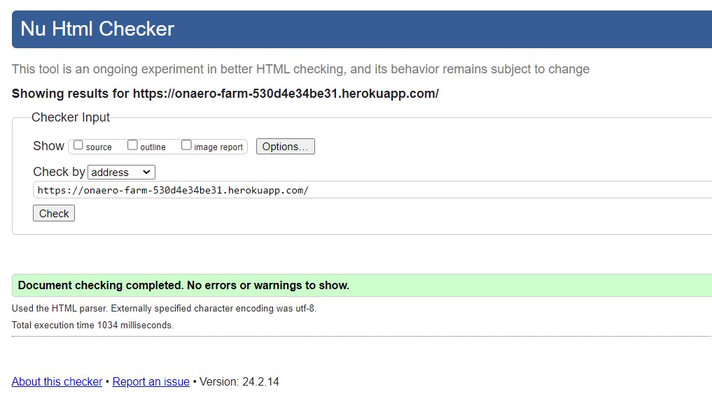

2. Products Page Validation Result : 
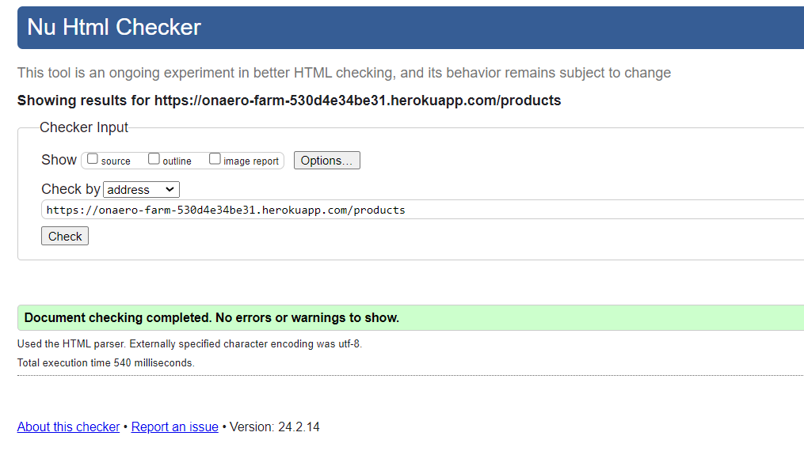

3. Products Details Validation Result : 
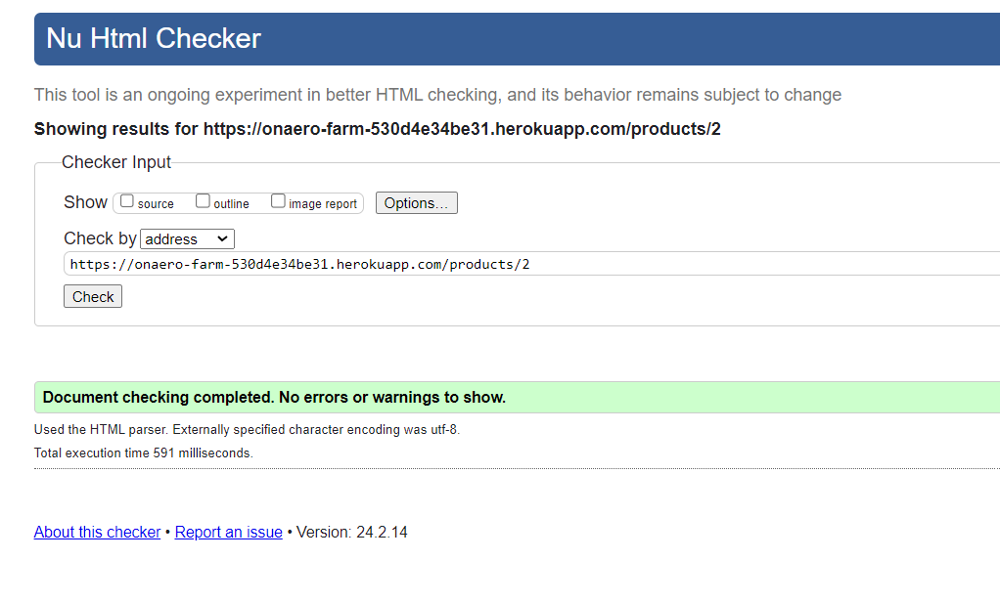

4. Bag Page Validation Result : 
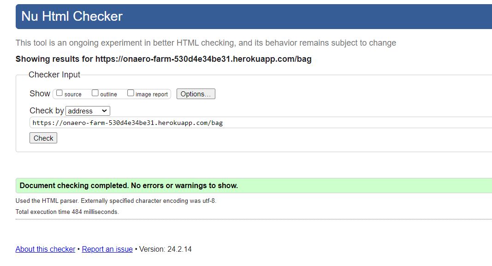

5. Accounts Signup Page Validation Result : 
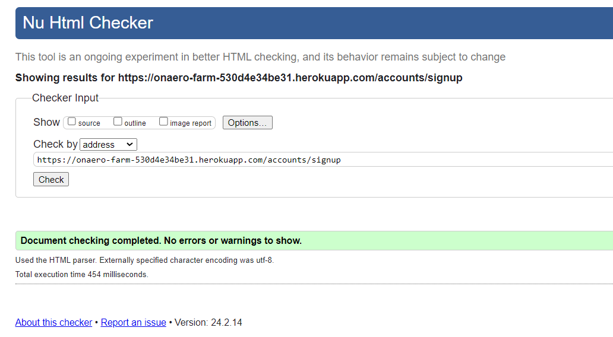

6. Accounts Login Page Validation Result : 
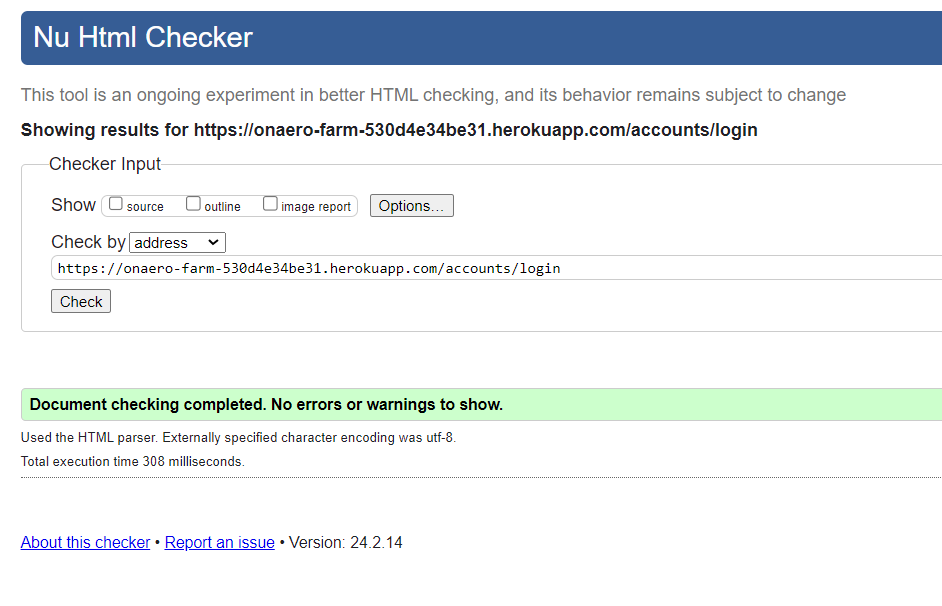

7. Password Reset Page Validation Result : 
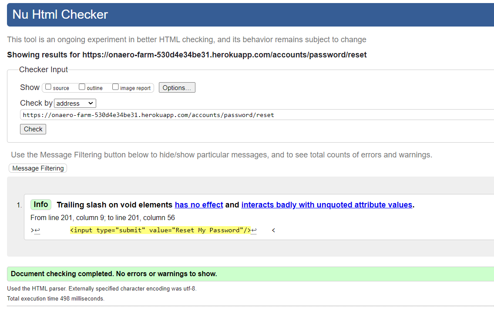

### W3C CSS Validations ### 

1. Base.CSS Validation Result : 
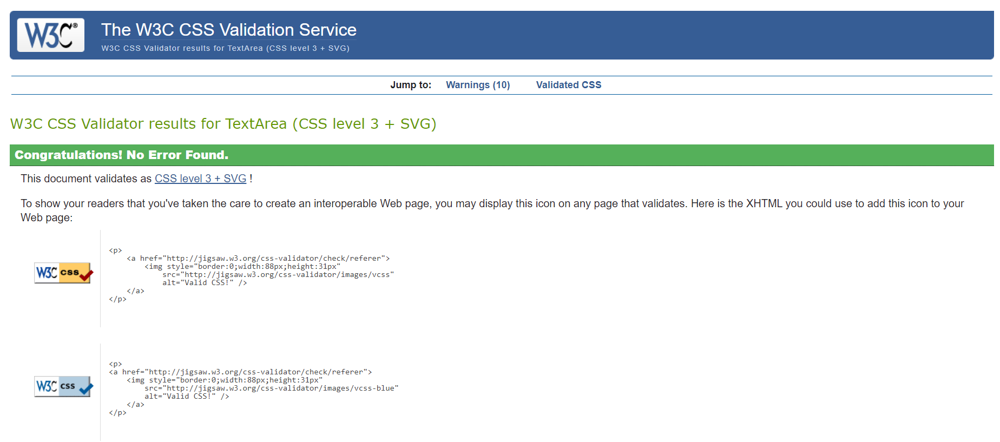

## CI Python Linter ##

* Code Institue Python linter - All Python files were put through the CI linter with no major issues arising.

## Lighthouse Tests ##

I have completed a series of lighthouse tests for the performance of the site and other aspects.

### Home Page Desktop : 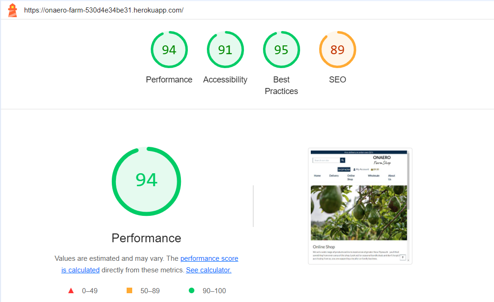

### Products Page Desktop : 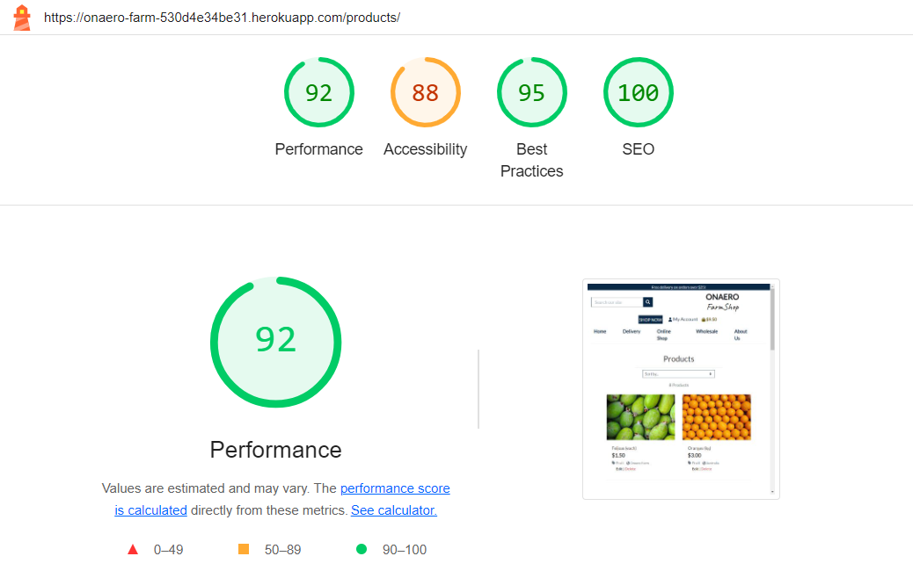

### Products Details Page Desktop : 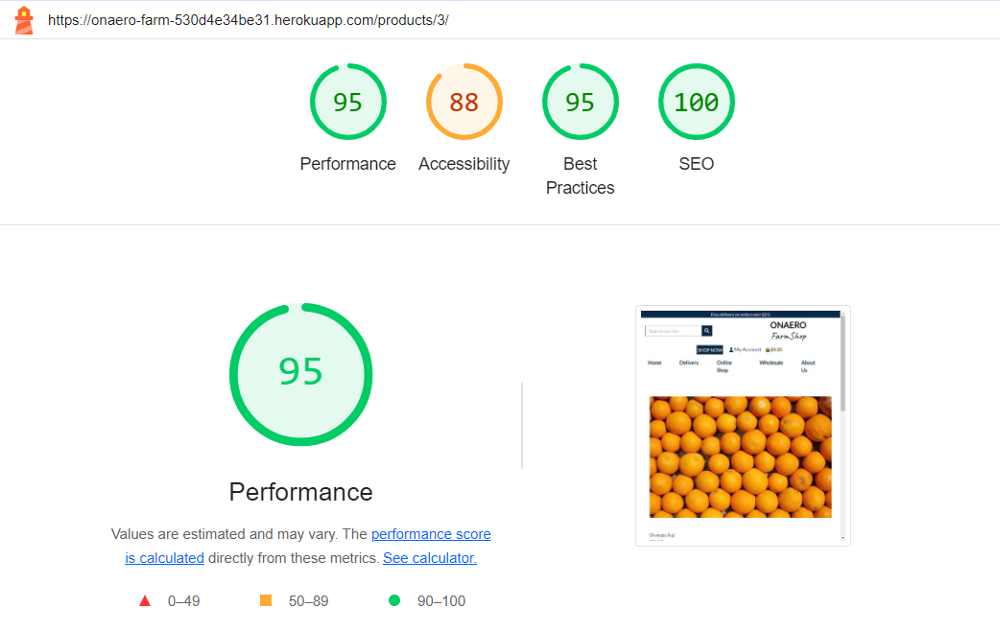

### Delivery Page Desktop : 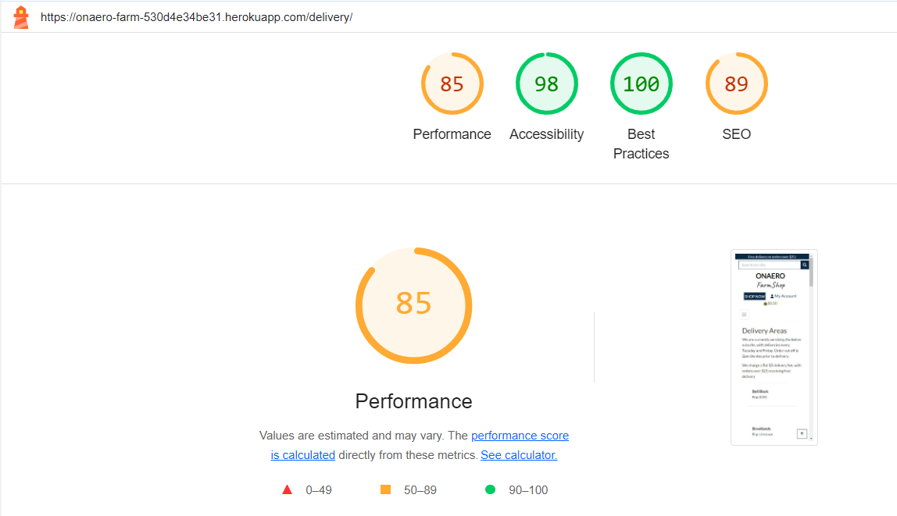

### Shopping Cart Page Desktop : 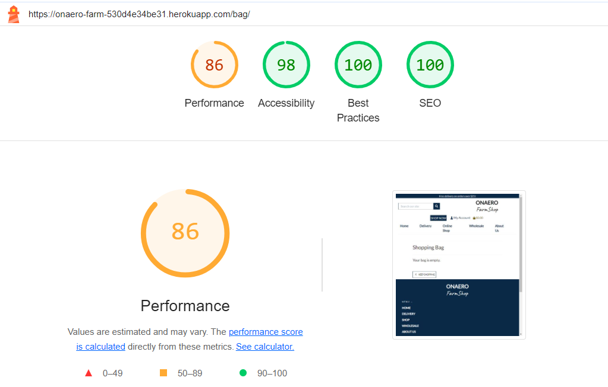

### Checkout Page Desktop : 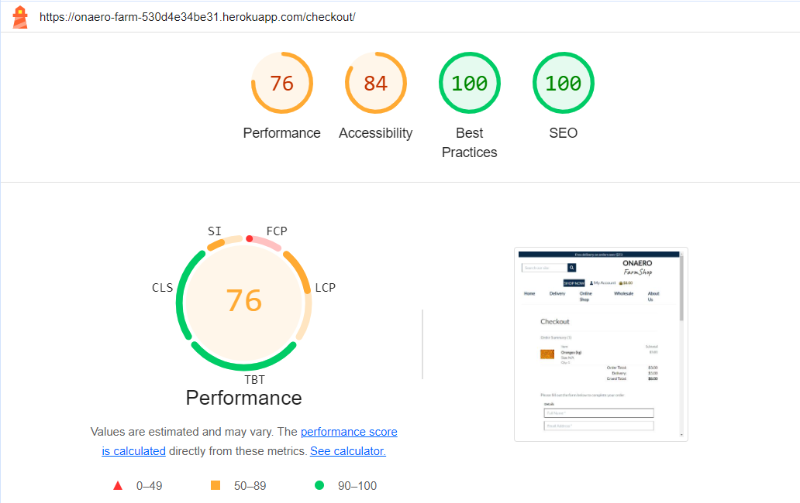

* From these tests I can see that performance wise the website could be initially improved, most likely it is due to image sizing/formats. I think with further optimizations the website can achieve fantastic results here.

## WAVE ##

I have also put the website through the WAVE accessibility testing with the following results :

## Website Responsiveness ##

The website has been developed to the most extent by the Front-End Library called Bootstrap. It is an amazing help towards front-end development that has a ton of features that help with the alignment of content around the website.
I have tested the website on multiple devices and it works great.
I have used the Chrome Development tools to adjust things accordingly to suit as much devices as possible.

## Bugs / Issues ##

Here I document any known to me or to anyone else that spots any bugs or issues currently going on with the site. 

        1. On specially small screen sizes the text from the dropdown menu from My Account navbar , overflows off screen as it is "too long" , which really is just a visual issue.

        2. On further inspection I have found by previously trying to fix the sorting by price filter on the products page I have made another bug that the sorting by ratings doesn't work properly. Also other filter types will need to be  adjusted to better suit the products as they don't seem to be working as intended either apart from Pricing from low-high / high-low. That issue will have to be addressed as soon as possible.

Any further issues upon inspection and review will be noted here.
I am dedicated to keeping this site free of any issues to provide the best experience for users as possible.