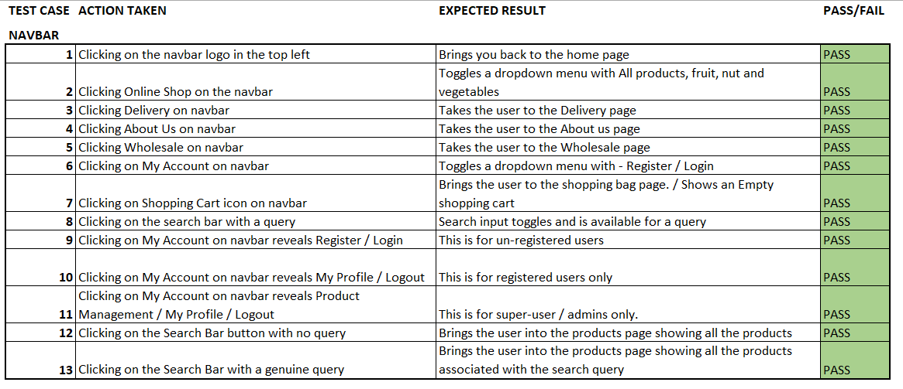
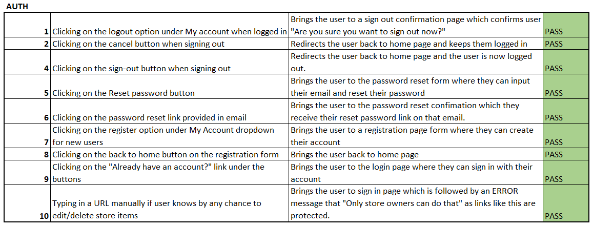
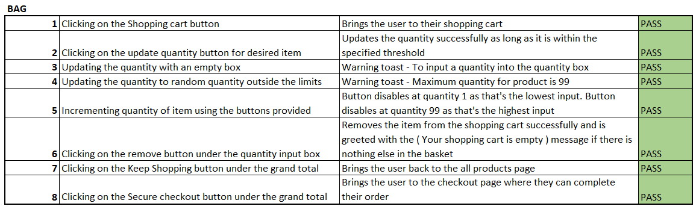
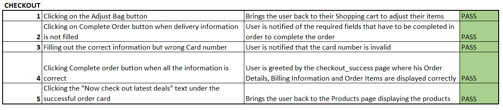
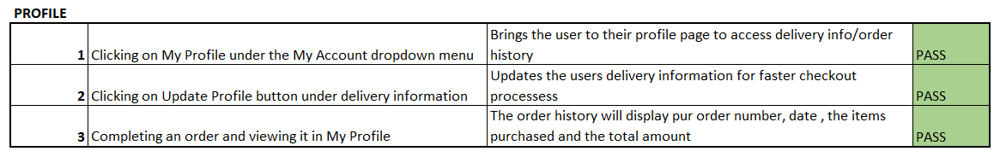
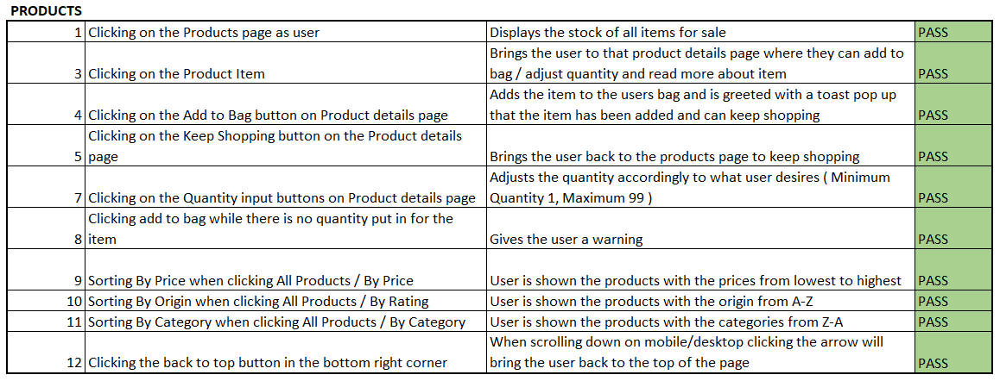
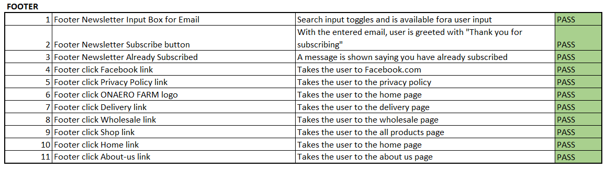
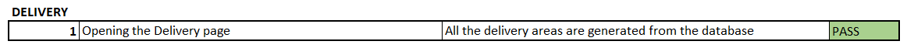

# Onaero Farm - Testing

The following document outlines the testing that was undertaken for this project.

## Testing Contents ##

* [Manual Testing](#manual-testing)
    * [Navbar](#navbar--screenshot)
    * [Auth](#auth--screenshot)
    * [Bag](#bag--screenshot)
    * [Checkout](#checkout--screenshot)
    * [Profile](#profile--screenshot)
    * [Products](#products--screenshot)
    * [Footer](#footer--screenshot)
    * [Delivery](#delivery--screenshot)
* [Validators](#automated-testing)
    * [CI Python Linter](#ci-python-linter)
    * [W3C CSS Validator](#w3c-css-validations)
    * [W3C HTML Validator](#w3c-html-validations)
    * [Lighthouse](#lighthouse-tests)
* [Bugs / Issues](#bugs--issues)

## Manual Testing ##

In this section I describe the extensive manual testing that was undertaken upon completion of the project.

## Navbar : 

## Auth : 

## Bag : 

## Checkout : 

## Profile : 

## Products : 

## Footer : 

## Delivery : 

## Validators ## 

### W3C HTML Validations ### 

1. Home Page Validation Result : 

2. Products Page Validation Result : 

3. Products Details Validation Result : 

4. Bag Page Validation Result : 

5. Accounts Signup Page Validation Result : 

6. Accounts Login Page Validation Result : 

7. Password Reset Page Validation Result : 

### W3C CSS Validations ### 

1. Base.CSS Validation Result : 

## CI Python Linter ##

* Code Institue Python linter - All Python files were put through the CI linter with no major issues arising.

## Lighthouse Tests ##

I have completed a series of lighthouse tests for the performance of the site and other aspects.

### Home Page : 

### Products Page : 

### Products Details Page : 

### Delivery Page : 

### Shopping Cart Page : 

### Checkout Page : 

* It is clear from these results, that the site needs further optimizations. Due to time constraints it wasn't possible at this stage but as this will be a real site in the future, these optimizations will take place in due course.

## Website Responsiveness ##

I have developed the website using bootstrap. The built in bootstrap classes allowed me to maintain responsiveness across all device sizes. I continuosuly checked for responsiveness throughout the project development. Chrome Development tools were of great assistance in this area.

## Bugs / Issues ##

There were a number of bugs during development. There are two bugs which I believe are fixed, but there is the potential for them to arise again. They are described below:

        1. AT one point in time, there was an issue with the container width and it caused there to be some side scroll in the website. I believe this issue is fixed.

        2. When the bag page was viewed in mobile, it was not possible to increase an item quantity. This was due to some javascript I wrote to prevent users from purchasing more than what is in stock. I have since removed this code due to time constraints.
